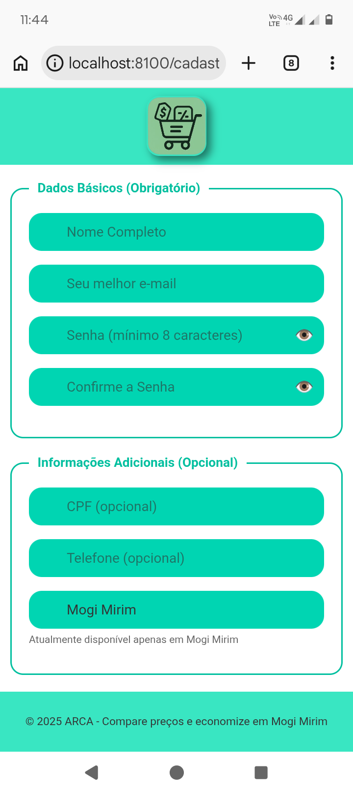
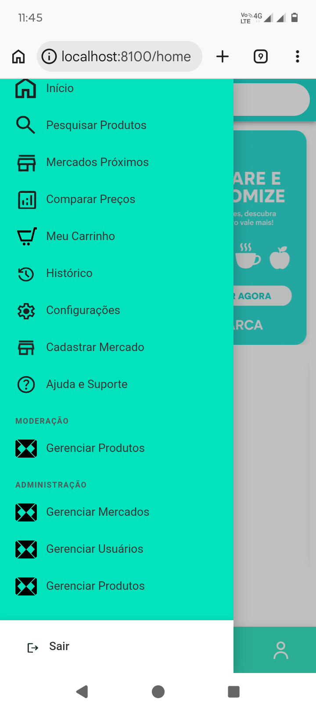
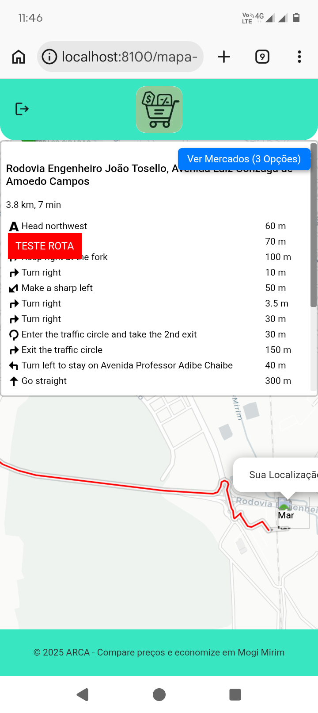

# 🛒 ARCA — Comparador de Preços de Supermercados


Desenvolvido como Trabalho de Conclusão de Curso (TCC) do curso **Técnico em Desenvolvimento de Sistemas** — ETEC Pedro Ferreira Alves, Mogi Mirim/SP. Previsão de conclusão: julho de 2025.

Aplicativo mobile para comparação de preços em supermercados, com foco em economia nas compras do dia a dia.

---

## 📸 Preview

| Home | Cadastro | Menu | Mapa |
|------|----------|------|------|
|  |  |  |  |

---

## 📱 Sobre o Projeto

O **ARCA** permite ao usuário visualizar e comparar preços de produtos entre diferentes supermercados da cidade.

Os dados são obtidos por múltiplas fontes:

* Atualização manual pelos supermercados
* Raspagem automática de dados (Python)
* Reportes dos usuários

Essa abordagem busca manter os dados sempre atualizados e confiáveis.

---

## ✨ Funcionalidades

### Usuário

* Pesquisa e comparação de produtos
* Lista de compras
* Mercados próximos e rotas
* Alertas de preço
* Histórico de pesquisas
* Assistente com IA
* Acessibilidade

### Supermercado *(em desenvolvimento)*

* Gerenciamento de preços
* Atualização em tempo real
* Estatísticas

### Administração

* Gerenciamento de produtos e categorias
* Controle de usuários e permissões
* Moderação de preços

---

## 🧠 Diferencial

Além da comparação de preços individuais, o ARCA permite analisar a **lista completa de compras** para identificar a melhor combinação de mercados e economia total.

---

## 🏗️ Arquitetura Simplificada

```
Fontes de dados (Scraping / App / Usuários)
                ↓
        MongoDB (dados brutos)
                ↓
     Tratamento e normalização
                ↓
     PostgreSQL (dados tratados)
                ↓
         API (Next.js)
                ↓
     Aplicativo mobile (Ionic)
```

---

## 🚀 Tecnologias

### Frontend

* Ionic + Angular
* Leaflet (mapas e geolocalização)
* Leaflet Routing Machine (rotas)

### Backend

* Next.js (API / BFF)
* Supabase / PostgreSQL
* MongoDB

## 📡 Integração de Dados

Atualmente, o ecossistema ARCA consome dados diretamente das APIs dos estabelecimentos, garantindo maior precisão e velocidade:

* **Arquitetura:** Python 3.12 com bibliotecas `requests` e `json`.
* **Fluxo:** Mapeamento de endpoints nativos -> Extração de JSON -> Tratamento de dados -> MongoDB.
* 
---

## 🔐 Controle de Acesso

* Usuário — funcionalidades do app
* Moderador — gerenciamento de produtos
* Administrador — acesso completo

---

## ⚙️ Execução Local

> Requer Node.js 18+ e Ionic CLI instalado.

```bash
git clone https://github.com/rodrigopereiradevelopment/arca-ionic.git
cd arca-ionic
npm install
ionic serve
```

Acesse: http://localhost:8100

---

## 🔒 Configuração

Crie o arquivo:

```bash
src/environments/environment.ts
```

```ts
export const environment = {
  production: false,
  geminiKey: 'SUA_CHAVE_AQUI'
};
```

📌 Alternativa recomendada: crie também um arquivo `environment.example.ts` como referência. O arquivo real não deve ser versionado.

---

## 📊 Banco de Dados

Principais entidades do sistema:

* Usuário
* Supermercado
* Produto
* Categoria
* Preço
* Lista de compras
* Histórico
* Alertas

---

## 🔮 Roadmap

* [ ] Integração completa com Supabase
* [ ] API em Next.js
* [ ] Interface para supermercados
* [ ] Automatização da raspagem
* [ ] Deploy da aplicação
* [ ] Testes automatizados

---

## 🤝 Contribuição

Este projeto foi desenvolvido para fins acadêmicos, mas melhorias e sugestões são bem-vindas.

---

## 👨‍🎓 Equipe

**Alunos — 3° Módulo, Técnico em Desenvolvimento de Sistemas (2025)**

* Rodrigo
* Bruno
* Miguel
* Felix

**Orientador:** Prof. Maurício Aparecido das Neves
**Coordenadora do Curso:** Prof.ª Simone Andreia de Campos Camargo

📍 ETEC Pedro Ferreira Alves — Mogi Mirim , SP

---

## 📝 Licença

Projeto desenvolvido para fins acadêmicos (TCC).
© ARCA — Mogi Mirim , SP — 2025

---

## 📚 Referências e Tecnologias

### 🖥️ Front-end
- [Ionic Framework](https://ionicframework.com/docs)
- [Angular](https://angular.dev/overview)
- [TypeScript](https://www.typescriptlang.org/docs/)
- [W3Schools - HTML](https://www.w3schools.com/html/)
- [W3Schools - CSS](https://www.w3schools.com/css/)
- [W3Schools - JavaScript](https://www.w3schools.com/js/)
- [Leaflet](https://leafletjs.com)

### ⚙️ Back-end
- [Next.js](https://nextjs.org/docs)
- [Python](https://docs.python.org/3/)
- [BeautifulSoup](https://www.crummy.com/software/BeautifulSoup/bs4/doc/)
- [Scrapy](https://docs.scrapy.org/en/latest/)
- [Playwright](https://playwright.dev/docs/intro)

### 🗄️ Banco de Dados
- [MongoDB](https://www.mongodb.com/docs/)
- [PostgreSQL](https://www.postgresql.org/docs/)
- [Supabase](https://supabase.com/docs)

### 🤖 Inteligência Artificial
- [Google Gemini API](https://ai.google.dev/docs)

### 🖼️ Imagens
- [Pexels](https://www.pexels.com)
- [Pexels API](https://www.pexels.com/api/documentation)
- [Open Food Facts](https://world.openfoodfacts.org)
- [Open Food Facts API](https://wiki.openfoodfacts.org/API)

### 🎵 Áudio
- [Pixabay Music](https://pixabay.com/music/) — músicas royalty-free
- [Freesound](https://freesound.org) — sons de UI (licença Creative Commons — verificar por arquivo)
